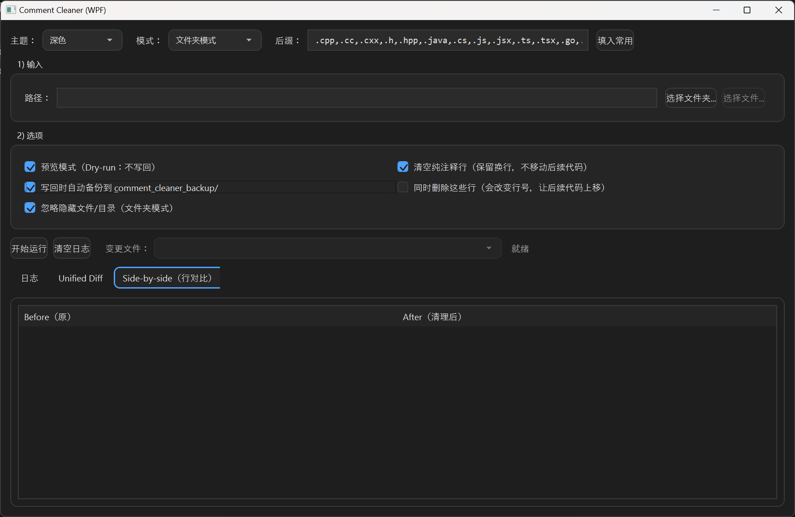

# Comment Cleaner

一个用于 批量删除代码注释 的 Windows 小工具。  

## 功能

- 清理行注释`//`  块注释`/** **/`  
- 预览模式（不更改文件内容，仅浏览改动）
- Unified Diff 预览
- Side-by-side 行对比
- 文件夹&单文件模式
- 按后缀过滤
- 写回前自动备份
- 深色主题🥰

## 支持语言（基于后缀）

- C / C++ (`.c .cpp .h .hpp .cc .cxx`)
- Java (`.java`)
- C# (`.cs`)
- JavaScript / TypeScript (`.js .ts .jsx .tsx`)
- Python (`.py`)
- Go / Rust / Kotlin / Swift (`.go .rs .kt .kts .swift`)

## 支持环境

- Windows 10  11
- .NET 8
https://dotnet.microsoft.com/zh-cn/download/dotnet/8.0

## 使用

从 Releases 下载

